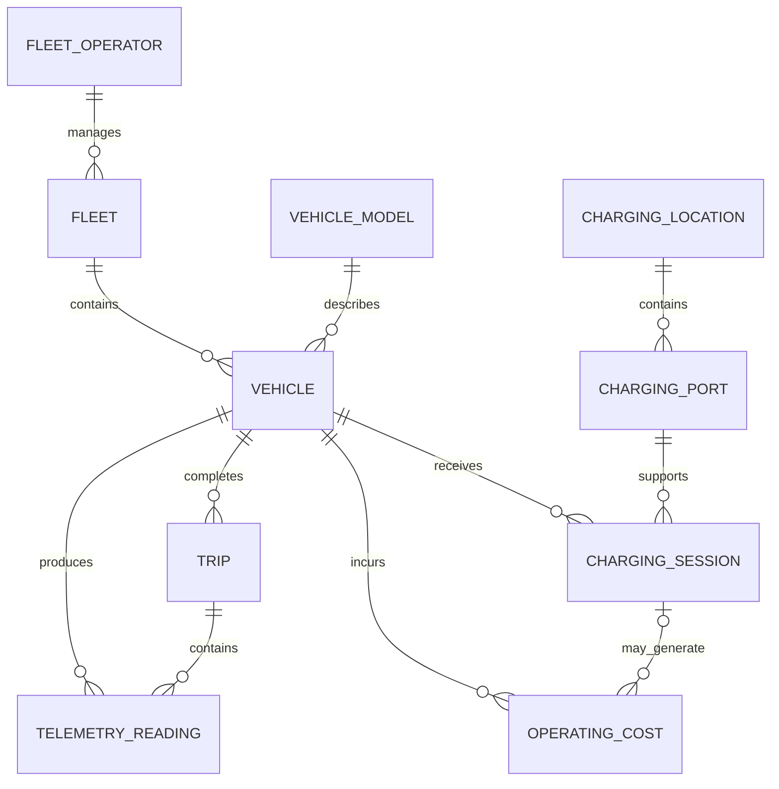

# MVP Relational Data Model

## Purpose

Defining how the platform’s data will be organized into related entities before creating physical SQL tables.

## Entity Inventory

### Fleet Operator

Representing an organization operating one or more EV fleets.

**Primary Key:** `fleet_operator_id`

**Attributes:**

- `operator_name`
- `industry`
- `city`
- `province`
- `operating_region`
- `operator_status`

### Fleet

Representing a group of electric vehicles managed by a fleet operator.

**Primary Key:** `fleet_id`
**Foreign Key:** `fleet_operator_id` → `Fleet Operator.fleet_operator_id`

**Attributes:**

- `fleet_name`
- `fleet_type`
- `city`
- `province`
- `operating_region`
- `fleet_status`

### Vehicle Model

Representing the manufacturer specifications shared by vehicles of the same model, such as battery capacity, range, and energy-consumption rating.

**Primary Key:** `vehicle_model_id`

**Attributes:**

- `manufacturer`
- `model_name`
- `model_year`
- `vehicle_class`
- `motor_power_kw`
- `battery_capacity_kwh`
- `electric_range_km`
- `energy_consumption_kwh_per_100_km`
- `recharge_time_hours`

### Vehicle

Representing an individual electric vehicle assigned to a fleet.

**Primary Key:** `vehicle_id`

**Foreign Keys:**

- `fleet_id` → `Fleet.fleet_id`
- `vehicle_model_id` → `Vehicle Model.vehicle_model_id`

**Attributes:**

- `fleet_vehicle_number`
- `vin`
- `licence_plate`
- `acquisition_date`
- `in_service_date`
- `initial_odometer_km`
- `vehicle_status`

### Trip

Representing a journey completed by a vehicle.

**Primary Key:** `trip_id`

**Foreign Key:** `vehicle_id` → `Vehicle.vehicle_id`

**Attributes:**

- `start_timestamp`
- `end_timestamp`
- `start_latitude`
- `start_longitude`
- `end_latitude`
- `end_longitude`
- `distance_km`
- `energy_consumed_kwh`
- `average_speed_kmh`
- `trip_status`

### Charging Location

Representing a physical station where vehicles can be charged.

**Primary Key:** `charging_location_id`

**Attributes:**

- `station_name`
- `street_address`
- `city`
- `province`
- `postal_code`
- `latitude`
- `longitude`
- `charging_network`
- `access_type`
- `station_status`

### Charging Port

Representing an individual charging connection available at a charging location.

**Primary Key:** `charging_port_id`

**Foreign Key:** `charging_location_id` → `Charging Location.charging_location_id`

**Attributes:**

- `port_number`
- `connector_type`
- `charging_level`
- `maximum_power_kw`
- `port_status`

### Charging Session

Representing an occasion when a vehicle is charged at a charging location.

**Primary Key:** `charging_session_id`

**Foreign Keys:**

- `vehicle_id` → `Vehicle.vehicle_id`
- `charging_port_id` → `Charging Port.charging_port_id`

**Attributes:**

- `start_timestamp`
- `end_timestamp`
- `starting_battery_percentage`
- `ending_battery_percentage`
- `energy_delivered_kwh`
- `price_per_kwh`
- `additional_fee`
- `charging_status`

### Telemetry Reading

Representing a time-based sensor reading collected from a vehicle during operation.

**Primary Key:** `telemetry_reading_id`

**Foreign Keys:**

- `vehicle_id` → `Vehicle.vehicle_id`
- `trip_id` → `Trip.trip_id`

**Attributes:**

- `reading_timestamp`
- `latitude`
- `longitude`
- `speed_kmh`
- `battery_percentage`
- `battery_temperature_celsius`
- `outside_temperature_celsius`
- `energy_consumption_rate_kw`
- `odometer_km`
- `operating_status`

### Operating Cost

Representing a charging, maintenance, repair, insurance, or other expense associated with a vehicle.

**Primary Key:** `operating_cost_id`

**Foreign Keys:**

- `vehicle_id` → `Vehicle.vehicle_id`
- `charging_session_id` → `Charging Session.charging_session_id` (optional)

**Attributes:**

- `cost_date`
- `cost_category`
- `cost_description`
- `quantity`
- `unit_price`
- `total_cost`
- `currency_code`
- `service_provider`
- `invoice_reference`

### EV Market Registration

Representing aggregated EV registration figures for a reporting period and Canadian geography.

**Primary Key:** `market_registration_id`

**Attributes:**

- `reference_year`
- `reference_quarter`
- `geography_level`
- `geography_name`
- `province_or_territory`
- `vehicle_type`
- `fuel_type`
- `registration_count`
- `total_registration_count`

## Entity Relationships

### Fleet Operator to Fleet

**Relationship:** One-to-many

One fleet operator can manage zero or many fleets. Each fleet must belong to exactly one fleet operator.

**Foreign Key:** `Fleet.fleet_operator_id`

### Fleet to Vehicle

**Relationship:** One-to-many

One fleet can contain zero or many vehicles. Each vehicle must belong to exactly one fleet.

**Foreign Key:** `Vehicle.fleet_id`

### Vehicle Model to Vehicle

**Relationship:** One-to-many

One vehicle model can describe zero or many individual vehicles. Each vehicle must be associated with exactly one vehicle model.

**Foreign Key:** `Vehicle.vehicle_model_id`

### Vehicle to Trip

**Relationship:** One-to-many

One vehicle can complete zero or many trips. Each trip must be associated with exactly one vehicle.

**Foreign Key:** `Trip.vehicle_id`

### Charging Location to Charging Port

**Relationship:** One-to-many

One charging location can contain zero or many charging ports. Each charging port must belong to exactly one charging location.

**Foreign Key:** `Charging Port.charging_location_id`

### Vehicle to Charging Session

**Relationship:** One-to-many

One vehicle can have zero or many charging sessions. Each charging session must belong to exactly one vehicle.

**Foreign Key:** `Charging Session.vehicle_id`

### Charging Port to Charging Session

**Relationship:** One-to-many

One charging port can support zero or many charging sessions over time. Each charging session must use exactly one charging port.

**Foreign Key:** `Charging Session.charging_port_id`

### Vehicle to Telemetry Reading

**Relationship:** One-to-many

One vehicle can produce zero or many telemetry readings. Each telemetry reading must belong to exactly one vehicle.

**Foreign Key:** `Telemetry Reading.vehicle_id`

### Trip to Telemetry Reading

**Relationship:** One-to-many

One trip can contain zero or many telemetry readings. Each telemetry reading must belong to exactly one trip.

**Foreign Key:** `Telemetry Reading.trip_id`

### Vehicle to Operating Cost

**Relationship:** One-to-many

One vehicle can have zero or many operating-cost records. Each operating-cost record must belong to exactly one vehicle.

**Foreign Key:** `Operating Cost.vehicle_id`

### Charging Session to Operating Cost

**Relationship:** Optional one-to-many

One charging session can produce zero or many operating-cost records. An operating-cost record can reference zero or one charging session because costs such as insurance or maintenance do not result from charging.

**Foreign Key:** `Operating Cost.charging_session_id` (optional)

## Market Data Separation

EV Market Registration remains separate from the operational fleet entities. It contains aggregated external market data rather than records describing a specific fleet, vehicle, trip, or charging session.

The operational and market datasets will be combined later through analytical dimensions such as reporting period, geography, and vehicle type rather than direct transactional foreign keys.

## Entity-Relationship Diagram

