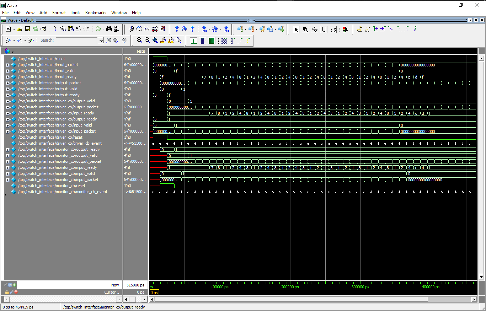
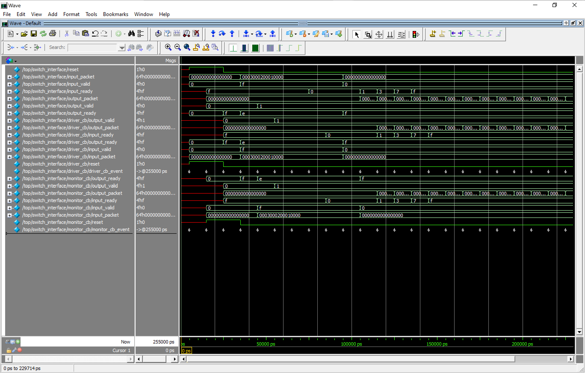

# 4-Port Packet Switch in Verilog

This project builds a small digital traffic controller from scratch using Verilog. It is designed to be understandable both to people discovering digital hardware and to engineers reviewing the RTL.

## What Does a Packet Switch Do?

Imagine a sorting station with four entrances and four exits. Small packages arrive through the entrances, and each package carries a label identifying the exit it should use.

The station must:

1. Read each package's destination label.
2. Send it toward the correct exit.
3. Hold it temporarily if that exit is busy.
4. Decide fairly when several entrances want the same exit.
5. Avoid losing or duplicating any packages.

A packet switch does the same job with digital information. The packages are called **packets**, and the entrances and exits are called **ports**.

This switch has four input ports and four output ports. Every packet contains a 2-bit destination field, which can identify one of four outputs:

| Destination | Selected output |
| --- | --- |
| `00` | Output 0 |
| `01` | Output 1 |
| `10` | Output 2 |
| `11` | Output 3 |

## How a Packet Moves Through the Switch

```text
Packet arrives
      |
      v
Wait in a small input queue
      |
      v
Read its destination
      |
      v
Compete for the requested output
      |
      v
Leave when that output is ready
```

Each stage solves a different problem:

- **Input queue:** Stores packets temporarily when they cannot move immediately.
- **Routing:** Reads the destination and directs the packet to the correct output.
- **Arbitration:** Chooses a winner when multiple packets request the same output.
- **Flow control:** Pauses traffic safely when a queue or output cannot accept more data.

Several packets can move during the same clock cycle when they are going to different outputs.

## What Happens During Congestion?

Suppose packets at Input 0 and Input 2 both want Output 1. Only one can use that output at a time, so one packet moves while the other waits in its input queue.

The switch uses a **round-robin** policy to choose between waiting inputs. After one input wins, the next decision begins with another input. This is similar to taking turns and prevents one busy input from continually cutting ahead of the others.

If an output stops accepting data, the switch keeps the packet in place. If the corresponding input queue fills, the switch tells the sender to pause. This controlled pause is called **backpressure**.

## Why Build This Project?

Although the switch is intentionally small, it brings together several important hardware-design skills:

- Designing clocked storage
- Moving data without loss or duplication
- Coordinating independent parts of a circuit
- Sharing a limited resource fairly
- Handling congestion and backpressure
- Separating a larger design into testable modules
- Writing automated, self-checking testbenches

These ideas also appear in network routers, processor interconnects, memory systems, and communication hardware.

## High-Level Architecture

```text
             +-------------+      +---------+      +--------------+
Input 0 ---> | Small queue | ---> |         | ---> |              | ---> Output 0
Input 1 ---> | Small queue | ---> | Routing | ---> | Fair output  | ---> Output 1
Input 2 ---> | Small queue | ---> | logic   | ---> | selection    | ---> Output 2
Input 3 ---> | Small queue | ---> |         | ---> |              | ---> Output 3
             +-------------+      +---------+      +--------------+
```

Each input has its own queue, implemented as a synchronous FIFO (first in, first out). The packet that arrived first is the first one considered for forwarding.

The design uses **input buffering**, which keeps the hardware compact and easy to follow. One known tradeoff is that a packet waiting at the front of a queue can temporarily block packets behind it, even if their outputs are free. This behavior is called head-of-line blocking and is accepted here to avoid unnecessary complexity.

## How Data Is Exchanged

Inputs and outputs use a simple `ready`/`valid` agreement:

- `valid` means, "I have a packet available."
- `ready` means, "I can accept that packet."
- A packet moves only when both are true on a clock edge.

If the receiver is not ready, the sender keeps the same packet available and waits. This makes traffic pauses predictable and prevents data from being dropped.

The packet will be a fixed-width group of bits. Two bits identify the destination; the remaining bits hold the packet's payload. Exact widths will be documented when the RTL interface is implemented.

```text
+----------------------+--------------------------------+
| Destination (2 bits) | Payload                        |
+----------------------+--------------------------------+
```

## Verilog Modules

The switch is divided into small modules so each part can be understood and tested independently.

| File | Purpose |
| --- | --- |
| `input_packet_queue.v` | Holds packets temporarily at one input. |
| `packet_destination_decoder.v` | Reads the destination of the oldest queued packet. |
| `fair_output_selector.v` | Uses round-robin priority to choose fairly between inputs requesting one output. |
| `packet_switch.v` | Connects four queues, four decoders, four selectors, and the external ports. |

The implementation will use standard, vendor-neutral Verilog and a single clock. The RTL will remain synthesizable where practical, meaning it can describe real digital hardware rather than simulation behavior alone.

## UVM Verification Plan

Verification will use SystemVerilog, UVM, and functional coverage. The synthesizable design remains written in Verilog, while the verification environment will generate traffic, observe transfers, predict expected behavior, and check results automatically. Waveforms will still be available for debugging and demonstration.

The planned UVM environment will contain:

- A transaction describing packet arrivals and output readiness
- A driver that applies ready/valid traffic to the switch
- A monitor that records accepted input and output transfers
- A scoreboard that predicts routing and checks packet delivery
- Functional coverage for destinations, ports, congestion, backpressure, and contention
- Directed and constrained-random sequences for normal and stressful traffic
- Focused tests selected by name and repeatable random seeds

Current verification implementation:

| Component | Status |
| --- | --- |
| Complete-switch interface and clocking blocks | Implemented |
| Transaction and typed sequencer | Implemented |
| Driver, monitor, and agent | Implemented |
| Reference-model scoreboard | Implemented and connected |
| Base randomized sequence and test | Implemented |
| Directed contention sequence and test | Implemented |
| FIFO-full and backpressure sequence and test | Implemented |
| Parallel-routing sequence and test | Implemented |
| Reset-during-traffic sequence and test | Implemented |
| Functional coverage model | Implemented and connected |
| UVM environment and simulation top | Implemented |
| Dependency-ordered compile file list | Implemented |
| Questa compilation | Passing with 0 errors and 0 warnings |
| Five-test UVM regression | Passing with 0 UVM errors and 0 UVM fatals |
| Questa compile and regression scripts | Not yet implemented |

Available UVM tests:

- `packet_switch_base_test` resets the switch, runs randomized ready/valid traffic, and drains all queued packets.
- `packet_switch_contention_test` drives all four inputs toward Output 0 to exercise repeated round-robin arbitration.
- `packet_switch_fifo_full_test` blocks Output 0 and fills every input queue to exercise backpressure.
- `packet_switch_parallel_routing_test` sends four simultaneous packets to four different outputs.
- `packet_switch_reset_during_traffic_test` resets the switch with packets buffered, then checks recovery traffic.

Tests are selected from the simulator command line with `+UVM_TESTNAME=<test class>`.

Implemented functional coverage measures every input-to-destination route, input and output handshake states, backpressure, simultaneous transfer counts, reset states, and reset transitions. The covergroups are ready for a simulator license that supports advanced verification features; the available Questa-Altera Starter license runs the tests with covergroups disabled.

Testing will answer questions such as:

- Does every destination send a packet to the correct output?
- Do packets leave each input in the same order they arrived?
- Can unrelated outputs carry packets at the same time?
- What happens when a queue becomes full or empty?
- Does the switch pause safely when an output is not ready?
- Are competing inputs served fairly over time?
- Are any packets lost, duplicated, or changed?
- Does the design return to a known state after reset?

Verification will begin with small components where useful, then focus on the complete switch under normal traffic, simultaneous traffic, congestion, long output stalls, and sustained contention.

Functional coverage will measure whether important situations were exercised, including every input-to-output route, multiple contention levels, full and empty queue behavior, output backpressure, simultaneous transfers, reset, and repeated arbitration among competing inputs.

## Intended Repository Structure

```text
verilog_packet_switch/
|-- DEVELOPMENT.md
|-- rtl/
|   |-- packet_switch.v
|   |-- packet_destination_decoder.v
|   |-- fair_output_selector.v
|   `-- input_packet_queue.v
|-- verification/
|   |-- interfaces/
|   |   |-- input_packet_queue_interface.sv
|   |   `-- packet_switch_interface.sv
|   |-- uvm/
|   |   |-- parameters_pkg.sv
|   |   |-- transaction.sv
|   |   |-- sequencer.sv
|   |   |-- driver.sv
|   |   |-- monitor.sv
|   |   |-- agent.sv
|   |   |-- scoreboard.sv
|   |   |-- coverage.sv
|   |   |-- environment.sv
|   |   |-- sequence.sv
|   |   |-- contention_sequence.sv
|   |   |-- fifo_full_sequence.sv
|   |   |-- parallel_routing_sequence.sv
|   |   |-- reset_during_traffic_sequence.sv
|   |   |-- test.sv
|   |   |-- contention_test.sv
|   |   |-- fifo_full_test.sv
|   |   |-- parallel_routing_test.sv
|   |   |-- reset_during_traffic_test.sv
|   |   `-- verification_pkg.sv
|   |-- files.f
|   `-- top.sv
`-- README.md
```

Only implemented files are shown. Questa run and regression scripts will be added after the simulator environment is configured.

A chronological explanation of the design and verification work is available in [DEVELOPMENT.md](DEVELOPMENT.md).

## Development Roadmap

1. Build the input queue, destination decoder, fair selector, and integrated switch RTL.
2. Compile and elaborate the complete RTL design.
3. Define the SystemVerilog interfaces and UVM transaction.
4. Build the driver, monitor, agent, scoreboard, and coverage model.
5. Verify routing, simultaneous transfers, congestion, backpressure, and fairness.
6. Add repeatable regression commands, coverage reporting, and example waveforms.

## Design Priorities

- Easy to understand and explain in an interview
- Modular Verilog with clear responsibilities
- No vendor-specific FPGA features
- No unnecessary protocol or control complexity
- UVM-based automated checks for expected behavior and edge cases
- Measurable functional coverage tied to the verification plan
- Clear documentation of design choices and tradeoffs

## Current Status

The four RTL modules are implemented and pass Verilog-2005 parsing and top-level elaboration with Icarus Verilog 12.0. The RTL has not yet been functionally simulated.

The first complete UVM testbench structure is implemented. It includes the switch interface, transaction, sequencer, driver, monitor, agent, reference-model scoreboard, functional coverage, environment, randomized and directed sequences, command-line-selectable tests, simulation top, and dependency-ordered file list.

The complete RTL and UVM environment compiles in Questa-Altera FPGA Starter Edition with zero errors and zero warnings. The base randomized-traffic test and the directed contention, FIFO-full, parallel-routing, and reset-during-traffic tests all pass with zero UVM errors and zero UVM fatals.

The Starter license does not provide the `svverification` feature required by constrained randomization and covergroups. The local regression therefore uses `$urandom` stimulus and runs with `-nocvg`; the driver, monitor, scoreboard, sequences, tests, and waveform generation remain active. Functional coverage execution remains pending access to a suitable advanced-verification license.

## Simulation Evidence

All five UVM tests compile and run in Questa-Altera FPGA Starter Edition with zero UVM errors and zero UVM fatals. The waveform below comes from `packet_switch_contention_test`, which drives all four inputs toward Output 0 under sustained traffic.



The waveform shows reset, packet buses, and ready/valid activity across the complete 515 ns run. The self-checking scoreboard independently verified packet routing, data, ordering, completed transfers, and round-robin arbitration decisions throughout the test.

The FIFO-full test below blocks Output 0 while all four inputs continue sending toward it. As the input queues fill, `input_ready` falls to `0` and applies backpressure. Once the output is released, readiness returns progressively while the stored packets drain.



`packet_switch_fifo_full_test` completed with zero UVM errors and zero UVM fatals, confirming that saturation and recovery did not lose, duplicate, reorder, or alter packets.
